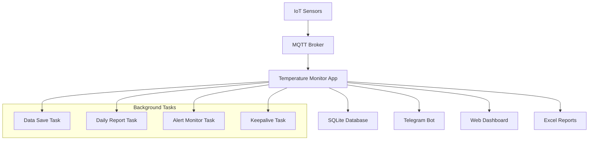

## 🌡️ Temperature Monitor - Sistem Monitoring Suhu Wijaya

<!-- Alternatif dengan HTML untuk kontrol layout yang lebih presisi -->
<div align="center">

<!-- Tech Stack Row 1 -->
<p>
  
  
  
</p>

<!-- Tech Stack Row 2 -->
<p>
  
  
  
</p>

<!-- Status Row -->
<p>
  <a href="https://opensource.org/licenses/MIT">
    
  </a>
  
  
</p>

<p><strong>Aplikasi web real-time untuk monitoring dan pelaporan suhu pada sistem pengeringan industri</strong></p>

<p>
  <a href="#demo">🚀 Demo</a> • 
  <a href="#fitur">📋 Fitur</a> • 
  <a href="#instalasi">⚙️ Instalasi</a> • 
  <a href="#dokumentasi">📖 Dokumentasi</a>
</p>

</div>

---

## 📋 Deskripsi

Temperature Monitor adalah aplikasi web berbasis Flask yang dirancang untuk memantau suhu real-time dari multiple dryer menggunakan protokol MQTT. Aplikasi ini menyediakan dashboard interaktif, notifikasi otomatis, dan sistem pelaporan yang komprehensif.

### ✨ Fitur Utama

- 🔄 **Real-time Monitoring** - Pemantauan suhu secara real-time dari 3 unit dryer
- 📊 **Dashboard Interaktif** - Interface web yang responsif dengan tema dark/light
- 🤖 **Notifikasi Telegram** - Alert otomatis melalui bot Telegram
- 📈 **Pelaporan Otomatis** - Laporan Excel harian yang dikirim otomatis
- 🔐 **Sistem Login** - Autentikasi pengguna dengan session management
- 📱 **Responsive Design** - Optimized untuk desktop dan mobile
- ⚠️ **Alert System** - Peringatan untuk suhu di luar batas normal
- 🌙 **Dark/Light Theme** - Theme switcher untuk kenyamanan pengguna

---

## 🛠️ Teknologi yang Digunakan

### Backend

- **Python 3.10+** - Programming language utama
- **Flask 3.1.2** - Web framework
- **SQLite** - Database untuk penyimpanan data historis
- **Paho-MQTT 1.6.1** - Client MQTT untuk komunikasi IoT
- **APScheduler 3.10.4** - Task scheduling
- **OpenPyXL 3.1.5** - Excel report generation

### Frontend

- **Bootstrap 5.3.2** - CSS framework untuk UI responsif
- **Bootstrap Icons** - Icon library
- **Flatpickr** - Date picker component
- **Server-Sent Events (SSE)** - Real-time notifications

### Communication & Integration

- **Python-Telegram-Bot 20.8** - Telegram bot integration
- **MQTT Protocol** - IoT device communication
- **REST API** - Data exchange endpoints

### Authentication & Security

- **Flask-Login 0.6.3** - User session management
- **Werkzeug Security** - Password hashing
- **CSRF Protection** - Cross-site request forgery protection

---

## ⚙️ Instalasi dan Setup

### 🔧 Prasyarat

```bash
- Python 3.10 atau lebih tinggi
- pip (Python package manager)
- MQTT Broker (HiveMQ, Mosquitto, dll.)
- Telegram Bot Token
- Git (untuk cloning repository)
```

### 📥 Langkah Instalasi

1. **Clone Repository**

   ```bash
   git clone https://github.com/your-username/temperature-monitor.git
   cd temperature-monitor
   ```

2. **Buat Virtual Environment**

   ```bash
   python -m venv venv

   # Windows
   venv\Scripts\activate

   # Linux/Mac
   source venv/bin/activate
   ```

3. **Install Dependencies**

   ```bash
   pip install -r requirements.txt
   ```

4. **Konfigurasi Environment Variables**

   Buat file `.env` di root directory:

   ```env
   # MQTT Configuration
   MQTT_BROKER=your-mqtt-broker-host
   MQTT_TOPIC_1="YOUR_MQTT_TOPIC"
   MQTT_TOPIC_2="YOUR_MQTT_TOPIC"
   MQTT_TOPIC_3="YOUR_MQTT_TOPIC"

   # Telegram Bot Configuration
   TELEGRAM_TOKEN=your-telegram-bot-token
   CHAT_ID="your-telegram-chat-id"

   # Authentication
   ADMIN_USER=admin
   ADMIN_PASSWORD="secure-password"
   SECRET_KEY="your-secret-key"

   # Optional: For production deployment
   FLY_APP_NAME=your-app-name
   ```

5. **Inisialisasi Database**

   ```bash
   python main.py
   ```

   Database SQLite akan dibuat otomatis saat aplikasi pertama kali dijalankan.

6. **Jalankan Aplikasi**

   ```bash
   python main.py
   ```

   Aplikasi akan berjalan di `http://localhost:8080`

---

## 🚀 Deployment

### Deploy ke Fly.io

1. **Install Fly CLI**

   ```bash
   # Windows (PowerShell)
   iwr https://fly.io/install.ps1 -useb | iex

   # Linux/Mac
   curl -L https://fly.io/install.sh | sh
   ```

2. **Login dan Setup**

   ```bash
   flyctl auth login
   flyctl launch
   ```

3. **Set Environment Variables**

   ```bash
   flyctl secrets set MQTT_BROKER=your-mqtt-broker
   flyctl secrets set TELEGRAM_TOKEN=your-telegram-token
   # ... set semua environment variables
   ```

4. **Deploy**
   ```bash
   flyctl deploy
   ```

---

## 📊 Alur Kerja Aplikasi

### 🔄 Architecture Overview



### 🎯 Proses Kerja Detail

#### 1. **Data Acquisition (Pengumpulan Data)**

- **MQTT Listener** menerima data suhu dari 3 sensor dryer
- Data mentah ditambahkan offset kalibrasi (+12.6°C)
- Data disimpan dalam memory untuk akses real-time

#### 2. **Data Processing (Pemrosesan Data)**

- **DataSaveTask** menyimpan data ke SQLite setiap 10 menit
- **MonitorDataTask** mengecek anomali data setiap 1 jam
- Data di-pivot untuk menampilkan timestamp dengan 3 kolom suhu

#### 3. **Alert System (Sistem Peringatan)**

- Monitor suhu diluar range normal (120°C - 155°C)
- Notifikasi dikirim melalui Telegram Bot
- Web notification real-time via Server-Sent Events
- Alert hanya aktif jam kerja (06:00-17:00)

#### 4. **Reporting System (Sistem Pelaporan)**

- **DailyExcelReportTask** generate laporan harian otomatis
- Laporan dikirim via Telegram setiap jam 00:00 WIB
- Manual report generation tersedia di web interface

#### 5. **Web Interface (Interface Web)**

- Dashboard real-time menampilkan suhu terkini
- Sistem login dengan session timeout 24 jam
- Historical data viewer dengan date picker
- Theme switcher (dark/light mode)

---

## 🎛️ Konfigurasi

### MQTT Settings

```python
MQTT_BROKER = "your-mqtt-broker.com"
MQTT_PORT = YOUR_PORT
MQTT_TOPICS = {
    "dryer1": "YOUR_MQTT_TOPIC",
    "dryer2": "YOUR_MQTT_TOPIC",
    "dryer3": "YOUR_MQTT_TOPIC"
}
```

---

## 📱 Penggunaan

### Login ke Aplikasi

1. Buka browser dan akses `http://localhost:8080`
2. Login dengan credentials yang di-set di environment variables
3. Session berlaku selama 24 jam

### Monitoring Real-time

- Dashboard menampilkan suhu terkini dari 3 dryer
- Status alert ditampilkan dengan color coding
- Notifikasi otomatis muncul jika ada alert

### Download Data Historis

1. Pilih tanggal pada date picker
2. Klik tombol "Download Data Ini"
3. File Excel akan didownload otomatis

### Telegram Commands

- Kirim "Mulai" untuk memunculkan menu interaktif
- **Test Message** - Test koneksi bot
- **Data Dryers** - Lihat 5 data terakhir
- **Force Excel** - Generate laporan manual

---

## 🤝 Kontribusi

Kami menerima kontribusi! Silakan:

1. Fork repository ini
2. Buat branch untuk fitur baru (`git checkout -b feature/AmazingFeature`)
3. Commit perubahan (`git commit -m 'Add some AmazingFeature'`)
4. Push ke branch (`git push origin feature/AmazingFeature`)
5. Buat Pull Request

---

## 📄 Lisensi

Distributed under the MIT License. See `LICENSE` for more information.

---

## 📞 Support & Contact

- **Developer**: Wijaya IT Group
- **Project Link**: https://python-internet-of-things-suhu.fly.dev/

---

<div align="center">

**[⬆ Back to top](#-temperature-monitor---sistem-monitoring-suhu-multi-dryer)**

Made with ❤️ by Wijaya IT Group

</div>
